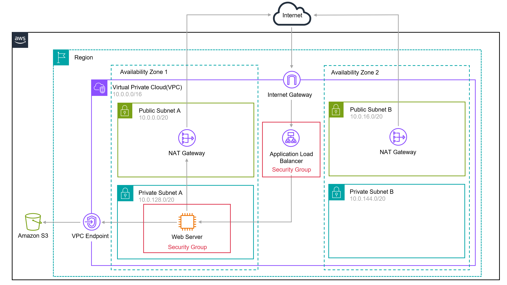

# AWS Web Server Deployment

## Overview
This project sets up a fully functional web server infrastructure on AWS using EC2, VPC, Security Groups, IAM, Load Balancer, Auto Scaling Group, and S3. The deployment ensures a secure, scalable, and efficient web hosting environment.

## Architecture Diagram

## Steps to Build the Website

### 1. Setup Networking (VPC)
- Create a VPC with both public and private subnets across two Availability Zones.
- Configure route tables to manage network traffic.
- Deploy a NAT Gateway to allow private subnets to access the Internet.

### 2. Resource Security (Security Groups)
- Create security groups for EC2 and Load Balancer with appropriate inbound rules.
- Apply security groups to restrict access to EC2 instances and ALB.

### 3. Access Management (IAM)
- Create an IAM Role for EC2 instances to grant necessary permissions.
- Attach policies such as `AmazonSSMManagedInstanceCore` and `AmazonS3ReadOnlyAccess`.

### 4. Deploy Compute (EC2)
- Launch an EC2 instance with a user-data script to install and configure a PHP web server.
- Associate the EC2 instance with the IAM Role and Security Group.

### 5. Administer Web Server (SSM)
- Use AWS Systems Manager (SSM) to manage EC2 instances without exposing SSH.
- Verify private and public IP addresses for connectivity testing.

### 6. Load Balancing (ALB)
- Create an Application Load Balancer (ALB) to distribute traffic.
- Set up a target group and register the EC2 instance.
- Attach the ALB to the security group and VPC.

### 7. Storage (S3)
- Create an S3 bucket for file storage.
- Upload required web assets.

### 8. Auto Scaling Group (ASG)
- Create a Launch Template for EC2 instances.
- Configure Auto Scaling Group (ASG) to handle traffic spikes dynamically.

### 9. Test Web Server
- Retrieve the DNS name from the Load Balancer.
- Open the website in a browser using HTTP.

### 10. Final Output
- Verify the deployment with the final web application output.

.png)
.png)

## Prerequisites
- AWS Account
- Basic knowledge of AWS services like EC2, VPC, IAM, ALB, and S3

## Deployment Instructions
1. Follow the steps outlined above in the given order.
2. Ensure each AWS resource is properly configured.
3. Use AWS Systems Manager for secure management.
4. Monitor logs and metrics via AWS CloudWatch.

## Conclusion
This setup ensures a highly available, secure, and scalable web hosting environment using AWS services. It leverages best practices for cloud deployments and infrastructure management.

---

### Author:
- **Naveenkumar D**

