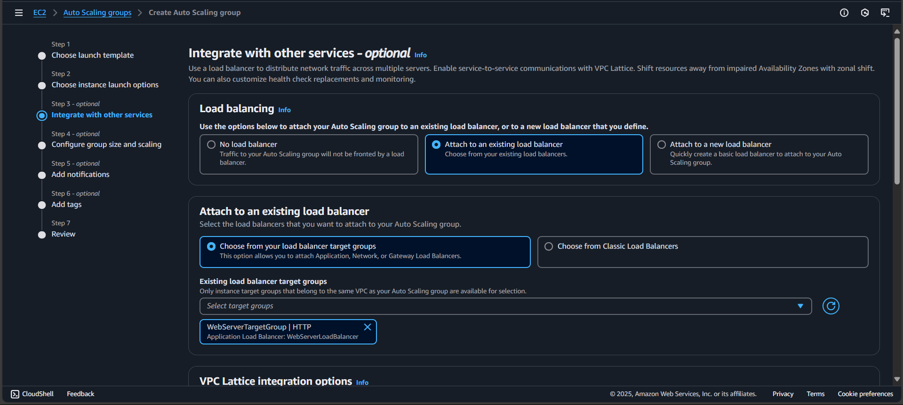

# `Architecture Diagram`


**Build Website**

1. [Setup Networking (VPC)](#1-setup-networking-vpc)
2. [Resource Security (SGs)](#2-resource-security-sgs)
3. [Access Management (IAM)](#3-access-management-iam)
4. [Deploy Compute (EC2)](#4-deploy-compute-ec2)
5. [Administer Web Server (SSM)](#5-administer-web-server-ssm5)
6. [Load Balancing (ALB)](#6-load-balancing-alb)
7. [Storage (S3)](#7-storage-s3)
8. [Scaling (ASG)](#8-auto-scaling-group)
9. [Test Web Server](#9-test-web-server)
10. [Final Output](#final-output)

## 1. Setup Networking (VPC)
- Navigate to the AWS Management Console and locate the VPC service.
- Click Create VPC.
- Select VPC and more. This will start the VPC wizard.
- Create a private and public subnet in 2 Availability Zone
  Each subnet is connected to a route table, which determines how network traffic is routed. The public subnets are routed to an Internet Gateway
- In the NAT gateways section, select 1 per AZ.
- Review the Network
  
- Click Create VPC
  
  

✅ **Your VPC with public & private subnets is now ready!** 🚀


## 2. Resource Security (SGs)
- Browse to the Security Groups part of the Amazon EC2 service.
- click Create security group to define a new custom security group for our resource
- In the Inbound rules section click Add rule
    1. Load Balancer --> HTTP	TCP	80	Anywhere-IPv4	Allow HTTP inbound from Internet
    2. EC2 --> HTTP	TCP	80	Load Balancer Security Group	Allow HTTP inbound from Load Balancer
- Tags are metadata labels you can apply to AWS resources for organization and cost tracking. Create a new tag for the security group by clicking Add new tag. Enter Name for Key and LoadBalancerSecurityGroup for Value.
- Finalize the creation by clicking Create security group


--


✅ **Your Secuirty Group is Created...** 🚀

## 3. Access Management (IAM)

- Browse to the IAM service and click create Role.
- Select AWS Service. Choose EC2 for the service or use case.
- Select EC2 Role for AWS Systems Manager and click Next
- Confirm that the AmazonSSMManagedInstanceCore policy and AmazonS3ReadOnlyAccess Policy has been added to the role and click Next
    
- Name the role. Scroll to the bottom and click Create role


## 4. Deploy Compute (EC2)

- Browse to the EC2 service.
- Click Launch Instance.
- Name the server and choose the created VPC, SG, add Role and paste the code then click create.
```
#!/bin/bash
yum update -y
# Install Session Manager agent
yum install -y https://s3.amazonaws.com/ec2-downloads-windows/SSMAgent/latest/linux_amd64/amazon-ssm-agent.rpm
systemctl enable amazon-ssm-agent
# Install and start the php web server
dnf install -y httpd wget php-json php
chkconfig httpd on
systemctl start httpd
systemctl enable httpd

# Install AWS SDK for PHP
wget https://docs.aws.amazon.com/aws-sdk-php/v3/download/aws.zip
unzip aws.zip -d /var/www/html/sdk
rm aws.zip

#Install the web pages for our lab
if [ ! -f /var/www/html/index.html ]; then
rm index.html
fi
cd /var/www/html
wget https://ws-assets-prod-iad-r-iad-ed304a55c2ca1aee.s3.us-east-1.amazonaws.com/2aa53d6e-6814-4705-ba90-04dfa93fc4a3/index.php

# Update existing packages
dnf update -y
```


## 5. Administer Web Server (SSM)
- In the Amazon EC2 dashboard, select the web server instance. You'll notice it only has a private IP address, not a public one
- Select the Session Manager tab in ec2 instance and click Connect.
- run the following commands:
```
echo -n 'Private IPv4 Address: ' && ifconfig enX0 | grep -i mask | awk '{print $2}'| cut -f2 -d: && \
echo -n 'Public IPv4 Address: ' && curl checkip.amazonaws.com
```

Excellent, there's the private IP address you noted in step 1 This means we successfully connected to the right instance without exposing the SSH protocol. However, you'll also notice there is a Public IP address - this is the Elastic IP allocated for the NAT Gateway. The NAT Gateway allows resources in the private subnet, like our web server, to communicate with the Internet.

## 6. Load Balancing (ALB)
- Create load balancer.
- Click Create under Application Load Balancer.

- Basic configuration
	1. Load balancer name	WebServerLoadBalancer
    2. Basic configuration	Scheme	Internet-facing
    3. Basic configuration	Load balancer IP address type	IPv4
    4. Network mapping	VPC	project-vpc
    5. Network mapping	Availability Zone 1	project-subnet-public1
    6. Network mapping	Availability Zone 2	project-subnet-public2
- add the Load Balancer Security Group you created earlier.
- add ALB security group

- Leave the default settings of HTTP and port 80 in the Listeners and routing section, then click Create target group.

- Configure the new target group with the following settings:
    1. Basic configuration	Target group name WebServerTargetGroup
    2. Basic configuration	Protocol	HTTP
    3. Basic configuration	Port	80
    4. Basic configuration	IP address type	IPv4
    5. Basic configuration	VPC	project-vpc
    6. Basic configuration	Protocol version	HTTP1
    7. Health checks	Health check protocol	HTTP
    8. Health checks	Health check path	/

 - Next to proceed to the register targets settings.

- Select mywebserver and click include as pending below. This will configure the load balancer to route web traffic from the Internet to the EC2 web server instance.

- Click Create target group to finalize the setup, 
 
- close the browser tab to return to the load balancer configuration.
- In the Listeners and routing section, click the refresh button and select the WebServerTargetGroup we just created
    
- click Create load balancer
 

## 7. Storage (S3)
- Click Create Bucket
- Upload some files to the bucket
- Download Data from this [Link](https://ws-assets-prod-iad-r-iad-ed304a55c2ca1aee.s3.us-east-1.amazonaws.com/2aa53d6e-6814-4705-ba90-04dfa93fc4a3/UnzipAndUpload.zip)

I1q4zFmh6aUry36LdHCe
database-1.ceondrue3w6e.us-east-1.rds.amazonaws.com

## 8. Auto Scaling Group
- Create Launch Template


- Create Auto Scaling Group using the Launch Template
  1. 

  2. 

- Review the information before creating ASG

## 9. Test Web Server
Copy the DNS name from the Load Balancer page and paste it into a new browser tab. Make sure it's http not https...


## Final Output:
.png)
.png)